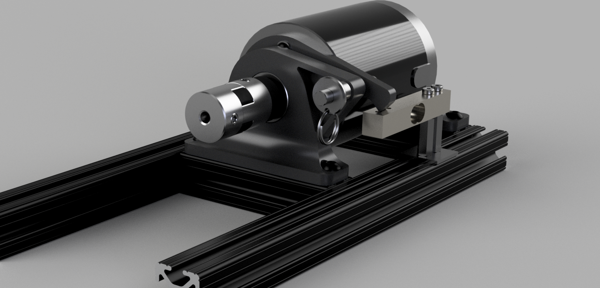
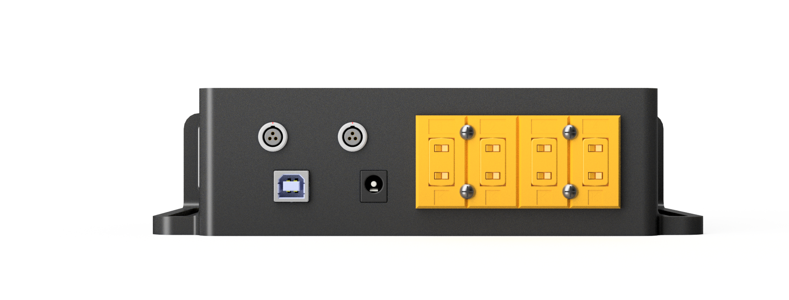

# Dynamometer

The goal of this project was to develop a flexible and adaptable dynamometer that would be used for measuring the performance of preliminary pump and turbine designs for a relatively low cost. Once performance of pump and turbine units are characterized on this small test bed dynamometer, requirements for "production" level parts could scaled using affinity laws, assuming hydraulic similitude. 

For a small rocket engine (1 - 2 kN thrust range), a centrifugal pump would generate about 500 W - 1500 W of hydraulic power at relatively high shaft speeds (25,000+ RPM). With [[empirical results]] showing 10% - 20% shaft-to-fluid efficiency for small centrifugal pumps, the pump driver would need to be capable of 2.5 kW - 15 kW power output. 

To keep cost of parts and tools low for a minimum-viable-product that could be used for preliminary testing, the target specifications were set by the motor, power supply, and physical footprint constraints. Where possible, components were FDM 3D printed from PETG plastic.

## Design



*Figure 1. Conceptual rendering of the dynamometer*
### Requirements
The dynamometer was initially sized to characterize the [pathfinder pump], which was estimated to require 478 W of shaft power at 3000 RPM to generate 21 meters of head rise.

1. Unit must function as a pump driver and turbine power absorber
2. Must be capable of 500 W at 3000 RPM
3. Must use cost-effective off-the-shelf parts
4. At minimum, must be capable of torque measurement of 1.6 Nm, shaft speed measurement of 3000 RPM.
5. Must weight less than 50 lbs for easy maneuvering
6. Must fit within 24" x 24" footprint
7. Must have logging capabilities of at least 100 Hz.
8. Motor must be powered from 110 V AC source

To satisfy requirement 1, a cradle dynamometer design featuring a DC brushed motor was chosen for its relative simplicity in measuring torque through reaction to the supplied load. The bearings supporting the motor would introduce losses proportional to operating speed, so dyno "dry runs" were performed to characterize the baseline torque then subtracted from subsequent measurements. To absorb any static torque caused by tension of the power supply wiring, a tare function was included in the control program to zero out readings.

### Specifications


*Figure 2. Overview of major components*


Original design specifications:

| Parameter            | Value | Measurement Precision | Unit  | Notes                                  |
| -------------------- | ----- | --------------------- | ----- | -------------------------------------- |
| Max Torque           | 6.2   | ± 0.03                | Nm    | Set by loadcell capacity and lever arm |
| Max RPM              | 5600  | ± 1                   | RPM   | Set by motor                           |
| Max Power            | 733   | ± 9                   | W     | @ 2800 RPM, set by motor               |
| Pressure Sensors     | 2     | ± 1                   | psig  | 100 psig at inlet and outlet           |
| RPM Sensors          | 1     | ± 3                   | RPM   | A3144 Hall sensor                      |
| Loadcells            | 1     | ± 0.01                | kg    | Parallel Beam with HX711 amplifier     |
| Thermocouples        | 4     | ± 2.2                 | C     | K-Type with mini-connector             |
| Power Supply Voltage | 24    | -                     | V     | Ampflow S-400-24                       |
| Power Supply Current | 17    | -                     | A     | Ampflow S-400-24                       |
| Motor Kv             | 237   | -                     | RPM/V | Ampflow E30-150-24                     |
| Motor Kt             | 0.04  | -                     | Nm/A  | Ampflow E30-150-24                     |
| Motor Resistance     | 0.19  | -                     | Ohm   | Ampflow E30-150-24                     |
*Table 1. First iteration specifications*


*Figure 3. Original motor (top) and performance curve (bottom)*

The Ampflow E30-150-24 originally chosen topped out at ~730 W, which would not be sufficient to power "production" level pump designs projects to require between 1 - 2 kW. Therefore, following completion of the pathfinder pump campaign, the dynamometer was upgraded with the larger Ampflow E30-400-24 motor capable of 1.5 kW. The 400W Ampflow S-400-24 power supply was replaced with a 1500W BOSYTRO 24V 62.5A power supply.


*Figure 4. Upgraded motor (top) performance curve (bottom)*

### Gearing
To step the shaft speed of the dyno up to required pump speeds exceeding 20,000 RPM, a 5:1 ratio helical gearset was added. Helical geometry was chosen to reduce noise and friction losses versus straight geometry.  The gears were originally 3D printed using PETG and held up in the ~400W range. However, as power approached 800W and speeds exceeded 20,000 RPM, the PETG gears melted and/or shattered. To remedy this, the gears were printed from PETG-CF to increase rigidity and wear-resistance and were liberally coated with grease. 

#### Turbine Mode

When operating in the turbine configuration, the motor is disconnected from the power supply and connected to a bank of high power parallel resistors. The dyno is fitted with the 5:1 gear assembly to step down the high turbine speeds (up to 28,500 RPM) and step up the relatively low torque. During [[preliminary testing]] in December 2024 with 4" diameter axial impulse turbine rotors, there was no need for the resistor bank as the motor's armature resistance was more than sufficient for the 20 or so Watts the turbine generated on 80 psig compressed air. 

Calculations for sufficient resistance and number of resistors were performed to estimate load torque for pathfinder turbines running at around 15000 RPM (3000 RPM at motor). To protect the motor armature and resistors, dissipated power per resistor added was calculated (Figure 6). The resistors chosen were 100W / 1 Ohm and would begin to saturate when only 1 or 2 were connected, so for low torque loads, run durations would be kept short or additional cooling would be provided.


*Figure 5. Resistive load and dissipated power per resistor added by number of resistors*


*Figure 6. Total and motor armature dissipated power by number of resistors*

As evident in Figure 6, dynamometer load would eventually max out around 600W if more resistors were to be added. For pathfinder turbine designs running on compressed air, 1 Ohm resistor bank would be more than sufficient for speeds around 3000 RPM at the motor. To increase load, 0.1 Ohm resistors would provide up to 2000W when running at the motor's rated 5700 RPM.

As of March 2026, turbine testing has been limited to the preliminary experiments with low power, plastic 3D printed axial rotors capable of no more than 20W, so the resistor bank has not yet been assembled.

### Electronics Box


*Figure 7. Conceptual render of electronics box*

#### Controller
The central processing and logging of sensor values is accomplished using an Arduino Uno, which was readily available at time and drove the subsequent design. The 10-bit on-board ADC would be sufficient to convert analog pressure transducer readings into ~0.1 psi steps for 100 psi transducers, well within the 1 psi accuracy of the sensors. The six analog input pins would enable the two pressure transducers and four thermocouples. The 16 MHz clock speed would be more than sufficient for 100 Hz sensor polling and communication cycles. The fourteen digital pins would be more than adequate for communication with the HX711 loadcell amplifier board and the eventual extra serial tx/rx commination with other Arduino-based controllers.

#### Power Distribution

#### Thermocouples
A 4-channel, panel mount thermocouple connection bus enabled easy mounting and integration of thermocouple receptacles.

Each thermocouple is connected to an AD8495 K-type breakout board, which when supplied with the Arduino's 5V supply, outputs temperature readings between -250 C and +750 C. This range would be  sufficient for exploratory pump and turbine working fluids of water and compressed air, respectively. Eventually, this range could cover cryogenic fluid and limited hot-gas testing (however isolating the plastic parts of the dynamometer from the test devices at these extreme temperatures would be a separate challenge).

Four thermocouple slots were chosen to measure:
- Pump or turbine bulk fluid inlet temperature
- Pump or turbine bulk fluid outlet temperature
- Motor interior temperature
- Motor outer casing temperature

#### Load Cell Amplifier
The HX711 loadcell amplifier breakout board was chosen for its on-board 24 bit ADC and 2-wire communication with the Arduino. The Arduino HX711 library was easy to set up and integrate. 

The loadcell was calibrated by balancing a 1 kg reference weight on one end of the beam and applying the measured output as a scale factor to convert ADC integer readings into engineering units (kg). However, another scaling factor including standard gravity and torque arm length was applied to the raw readings along with the mass conversion to directly yield a torque measurement. 

#### Analog Sensors
The only analog measurements implemented on the Arduino were for COTS pressure transducers. The Arduino's on-board 5V power supply powers the sensors which return voltages from 0.5V -  4.5V.  Therefore, the 0 - 100 psig pressure range is divided over the ~800 counts among the total 1023 available from the 10-bit ADC.

This means that there is roughly 0.12 psi per count, which is precise enough given the stated accuracy of the 100 psi pressure transducers is 1% FS, or 1 psi.

To calibrate the sensors, a bike pump with analog pressure gauge was connected to each pressure transducer, and pressures from 0 to 100 psig in increments 20 psig were generated with the pump. For each measurement, the raw ADC counts were recorded. Then, a linear curve was fit for each transducer, yielding the count-to-psi scale and offset factors. These factors would then be applied in the monitoring and logging software to accurately log pressure values.


*Figure 8. Pressure versus count calibrations*
#### Hall Effect Sensor
To measure shaft rpm, a small neodymium magnet is mounted on the motor shaft using a 3D printed collar that is locked using the shaft's keyway. Just underneath the shaft is a A3144 hall effect sensor breakout board. The board's digital output triggers an interrupt in the Arduino code which counts period between interrupt pulses. There is some extra logic to clean up readings and convert to RPM units. 

#### Interface



*Figure 9. Electronics box interface*

The electronics box exposes the Arduino's USB-B and DC input power port. There are two 3-pin LEMO connectors for the analog inputs (pressure transducer) and a panel of four thermocouple mini-connector receptacles. The box includes slots through which 1/4-20" screws can affix the box to the dynamometer's 1" extruded aluminum frame.

### GUI
A custom Python desktop application levering PyQT framwork was developed for monitoring and recording the dynamometer data. The application is multi-threaded to handle application-to-Arduino communication, display refresh, and logging functions at a real time rate in the 50 - 100 Hz range.

The UI includes COM port configuration, signal file (sort of like database file for CAN networks, but .json format) for engineering unit conversion, and "LCD" displays for real time monitoring of all signals. There is a plot (pyqtgraph) viewable at the bottom of the UI with adjustable buffer length. 

A "tare" button is available to zero-out any of the signals by applying an offset factor from the current vale to zero. This function is useful for zeroing the loadcell before torque measurements (ie - the additional torque produced by the motor reaction above other static torque being applied to the motor casing by wires, etc.)


*Figure 10. Desktop interface*


### Communication Protocol
The communication protocol between the Arduino and Python GUI is handled over serial USB connection and is fairly rudimentary:

After polling/calculating sensor values, the Arduino prints (effectively as a string) time, rpm, loadcell, temperatures, and pressures separated by a comma to the Serial output.

Meanwhile, the Python GUI listens for bytes on the COM port connect to the Arduino and splits the incoming "string" using comma delimiter. The unpacked strings are converted to floats, then a scale and offset are applied to the values from a "signals.json" file. The values now in physical units are then used for displaying on the GUI and recording.  

An example "signals" file contents is encoded as scale, offset, and rounding factor

```json
{  
  "time": [0.001, 0, 3],  
  "rpm": [1,0, 0],  
  "torque": [0.000622935, 0, 3],  
  "temp1": [0.9765625, -250, 1],  
  "temp2": [0.9765625, -250, 1],  
  "temp3": [0.9765625, -250, 1],  
  "temp4": [0.9765625, -250, 1],  
  "pres1": [0.1221, -12.45421, 2],  
  "pres2": [0.1221, -12.45421, 2]  
}
```

### Data Output

While recording, the data (converted from the "raw" bytes read from COM port) is stored in a memory buffer. When recording is terminated, the buffer is written to a csv file with signal names as headers.

For example:

| time  | rpm  | torque | temp1 | temp2 | temp3 | temp4 | pres1 | pres2 |
| ----- | ---- | ------ | ----- | ----- | ----- | ----- | ----- | ----- |
| 0     | 1334 | 0.586  | 23.4  | 11.7  | 737.3 | -69.3 | 5.37  | 5.98  |
| 0.013 | 1334 | 0.586  | 24.4  | 8.8   | 737.3 | -76.2 | 4.88  | 5.25  |
| 0.026 | 1334 | 0.586  | 24.4  | 13.7  | 737.3 | -74.2 | 4.52  | 2.93  |
| 0.039 | 1334 | 0.586  | 24.4  | 16.6  | 737.3 | -66.4 | 4.15  | 3.3   |
| 0.053 | 1334 | 0.586  | 23.4  | 15.6  | 737.3 | -61.5 | 4.64  | 4.4   |
| 0.067 | 1334 | 0.586  | 24.4  | 15.6  | 737.3 | -78.1 | 4.76  | 6.35  |
| 0.079 | 1334 | 0.586  | 24.4  | 13.7  | 737.3 | -75.2 | 5.49  | 6.1   |
| 0.093 | 1334 | 0.586  | 24.4  | 17.6  | 736.3 | -64.5 | 4.64  | 4.52  |
| 0.106 | 1334 | 0.586  | 23.4  | 14.6  | 737.3 | -62.5 | 4.76  | 3.17  |
| 0.119 | 1335 | 0.586  | 23.4  | 11.7  | 737.3 | -65.4 | 5.13  | 3.17  |

The data can then be manipulated for analysis. For instance, power can be calculated from the rpm (first converted to rad/s) and torque columns. 

## Fabrication

The dynamometer is primarily made up of 1" extruded aluminum frame and 3D printed PETG components. The motor sits in 3D printed bearing blocks that are secured to transverse members in the extrusion box frame. The frame sits at 12" L x "8" W x "7" H. The transverse members on which the motor mounts sit are capable of translation for adjustment as well as spread to accommodate different length motors. The test device mount frame is a 3D printed PETG and features four 1/4"-20 mount bolts. The test device shaft is connected to the motor via coupler with rubber spider to take up radial misalignment. The torque arm which is secured to the motor casing and transfers the reaction torque to the frame-mounted loadcell is 3D printed PETG. Since the torque arm requires sufficient strength to resist plastic deformation under the highest rated load of ~100 N, it was printed with 100% infill - also to simplify geometry for FEA simulation. FEA simulation confirmed sufficient safety factor and minimal displacement (0.28 mm) under 100 N reaction force.

### 2022
- 1D design:
	- Motor sizing, resistor bank sizing
- 3D design:
	- CAD modeling of major components
	- CAD layout of major components and frame
	- 3D printed parts designed, tolerance, and sliced for FDM printing
- BOM creation
	- Total cost ~$1,200 for parts, tools, consumables
- Parts and tools ordering
	- McMaster-Carr
	- Amazon
- Initial wiring and tests of power supply, motor controller, and motor
- Breadboard layout of Arduino Uno (for logging), load cell, and HX711 amplifier
	- Note: This was my first Arduino project
- Initial 80x20 frame build and motor integration
	- Motor cradle and torque arm 3D printed PETG on Prusa MK3S+
- Electronics Box 3D printed, boards installed, and wired


*Figure 11. FEA simulation displacement results of the motor torque arm under 100 N load*


*Figure 12. Wiring of motor, controller, and power supply*


*Figure 13. Breadboard layout of electricals*


*Figure 14. Early motor, cradle, and load cell integration on frame*


*Figure 15. Electronics box assembly ready for integration with frame*


*Figure 16. Closeup of loadcell and torque arm assembly*

### 2023
- Frame raised 100 mm to accommodate larger diameter devices under test
- First integration of pathfinder centrifugal pump


*Figure 17. First assembly of dyno; device mount not installed*


*Figure 18. Full assembly with pathfinder centrifugal pump installed*


### 2024
- [[Testing with pathfinder centrifugal pump]]
- Motor temperature during prolonged testing would exceed 70 C, prompting addition of two 24V PC fans for convective cooling
	- Temperatures did not exceed 40 C following addition of fans (show data)
- Exploratory test with compressed air axial turbine
- CAD design and FDM printing of 5:1 gearbox
- Exploratory testing of radial inflow turbine rotor


*Figure 20. Cooling fans installed*


*Figure 21. Early experiments with geartrain and radial turbine*

### 2025
- Testing with "production" geometry centrifugal pump designs
- Integrated upgraded AmpFlow E30-400-24 motor
- CAD design and integration of 5:1 geartrain with idler gear
	- Allowed pumps shafts to spin counter to motor reaction torque without installation of pump over the dyno, mitigating risk of water intrusion into electrical components
- For safety, a 3D printed cover was added to shield the gears:
	- Preventing contact with body parts during operation
	- Containing debris in the event of violent disassembly


*Figure 22. Upgraded motor and geartrain with idler*


*Figure 23. Damaged gear following high power test*


*Figure 24. Improved PETG-CF geartrain*


*Figure 25. Protective cover installed*


*Figure 26. Rear side of protective cover*

### 2026

#### May 31, 2026

Following pump tests, there was evidence contact observed between the impeller and volute casing, which was not present during static conditions - even with mild axial shaft play. Axial thrust acting on the impeller from the fluid pulls it toward the pump inlet while the axial thrust from the driven helical gear on the pump shaft pulls it away from the inlet. In theory, this would help cancel axial forces and the impeller would remain stationary (axially), however this was not observed (based on evidence after teardown) particularly at high loads. There is also axial play in the flexible coupler between the driver gear and motor, so this would also lead to weird dynamics across transients. 

To reduce geartrain contribution to axial displacement of the pump shaft, the helical gears will be replaced with straight cut gears.